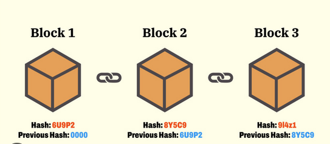

# Understanding Blockchain

- [Introduction to Blockchain](#introduction-to-blockchain)
- [Understanding Blockchain](#understanding-blockchain-1)
- [Blockchain Solves the Double-Spending Problem](#blockchain-solves-the-double-spending-problem)
- [Properties of Blockchain](#problems-of-blockchain)
- [When to Use Blockchain](#when-to-use-blockchain)
- [When Not to Use Blockchain](#when-not-to-use-blockchain)
- [Existing Implementations of Blockchain](#exisiting-implementations-of-blockchain)

## Introduction to Blockchain

Blockchain technology was born with the invention of Bitcoin - a new form of **peer-to-peer** (**P2P**) electronic cash - back in 2008. The Bitcoin whitepaper was released on October 31, 2008 and the first release of Bitcoin came on January 3, 2009. The blockchain space is still a toddler in terms of adoption and the tools available. It has some unique properties that did not exist before in any of the previous systems or software applications. The most important property of blockchain is establishing trust between two or multiple parties without needing any intermediaries, which opens a new era in programming.

Ethereum is one of the implementations of blockchain. Ethereum is an open source, public, and distributed computing platform. On Ethereum, developers can deploy smart contracts written in the Solidity language and build a decentralized application - also called dApp, Dapp, or DApp.

Smart contracts are small programs where developers can define the rules of the trust that intended to code. One of the mind-boggling properties of smart contracts is _immutability_ - once they are deployed on the blockchain, their code _cannot_ be changed. This immutable property makes it very hard to program smart contracts and predict errors/bugs beforehand.

In this chapter, we will learn more about blockchain technology, and when and where blockchains should be used. We will also introduce Ethereum and smart contracts.

The following topics will be covered in this chapter:
- Introduction to Blockchain
- Properties of a Blockchain
- What is Ethereum?
- Introduction to smart contracts
- Why smart contracts are different from traditional software programs

## Understanding Blockchain

A blockchain is a timestamped series of immutable transactions that is managed by a cluster of computers using special computer algoritms. These immutable records are not owned by any single entity. A blockchain is a decentralized P2P network of nodes. Each node in a blockchain shares the same copy of data, also called the **digital signature**. Each node present in the network uses the same algoritm to reach a **consensus**.

A blockchain, by design, is resistent to the modification of data. The ledger can record transactions between two parties in a verifiable and permanent way. Whenever there is a change in the ledger using transactions, changes are distributed to all the nodes, to verify and update their own copy of the ledger. Once a transaction is stored and verified by all the nodes in the network, then it is not feasible to change the transaction without altering all the subsequent and previous blocks. That's why blockchain transactions are irreversible, as blockchain transactions and their data are append only.

Each computer that participates in this P2P network is called a **node**. Each node maintains the records of transactions in multiple consecutive blocks. The P2P netowrk is also used in torrents such as BitTorrent; however, torrent networks are not like blockchains, as they are designed to shares files only.

Blockchain technology is all called **Decentralized Ledger Technology (DLT)**, as each node in the network keeps the same copy of the ledger. Please have a look at the following diagram:

In the preceding diagram, each **block** is connected with a link (also known as a **chain**). The chain is usually recognized as the chain of all the blocks. The link between two blocks is implemented by having a record of the cryptographic has of the previous block in each block, so that you can visit the chain in reverse chronological order.

One question that may arise in your mind is, what is the difference between a traditonal software application that processes the transaction and a blockchain that also processes the transaction? Then, why would you need blockchain technology? Well, blockchain technology solved one of the hard problems of computer science - the **double-spending** problem. Let's understand what is the double-spending problem...

- **Note**: It is extremely hard to revers a blockchain transaction. However, there have been cases when a 51% attack allowed an attacker to double-spend coins. One such example is when the **Ethereum Class** (symbol: **ETC**) was attacked with a 51% attack, in which approximately $1.1 million worth of ETC was lost.

## Blockchain Solves the Double-Spending Problem

As we know, we can share documents and pictures over the internet with someone. When we share those documents or pictures with another person, we actually share a copy of the file. Once that copy is sent to another person, you and the other person have the same copy of that document.

However, things such as money, bonds, and shares must not be shared as copies, like we do for documents/pictures when we need to transfer them over the internet. If you try to send money P2P, without using any intermediaries, then both parties end up having the came copies of the money. This is called the double-spending problem.

For example, if Alice gives a $10 bill to Bob, then Alice must not hold a copy of the $10 bill, as it's given to Bob. These are called **value transfers**. To transfer those items that have values over the internet, we need to depend upon **Trusted Third Parties (TTPs)**. Banks and stock exchanges are the TTP on which we rely for transferring values (money and shares) from person A to B. For value transfers between two parties over the internet, they both have to depend upon a trusted middle party (centralized) to process the transactions and ensure the safety of transactions.

Blockchain solved this double-spending problem. Now, for value transfers between two parties, neither of them have to depend upon a middleman (trusted party). They both can do safe transactions directly. Blockchain's decentralized netowrk and consensus algorithm ensures the safety of transactions and prevents the double-spending problem.

## Problems of Blockchain

Blockchain has properties of both decentralized and distributed networks. Using those types of networks along with cryptography adds more properties. We are covering properties related to the Ethereum Blockchain rather than other blockchain implementation properties. The other blockchain implementations might have different properties. Let's discuss those properties.

- **Distrubuted Ledger**
    - Multiple nodes make up a distributed blockchain network. All nodes share a common ledger, where records of transactions are kept.

- **Fault Tolerance**
    - A blockchain network is distributed and each node maintains the same record of the ledger. Even if some nodes in the network are corrupted or go down, it can continue operating safely up to a certain limit, as well as processing transactions with running nodes.

- **Attack Resistance**
    - A blockchain network does not have centralized control. The network's resistance to attacks is maintained by the miners who are putting their processing power (using nodes) into use to guard against malicious attacks. These miners earn some incentives to keep the network safe by behaving honestly. This is done by using the distributed network and cryptographic techniques.

- **Remove Intermediaries**
    - Blockchain technology removes the dependence on TTP/middle parties/intermediaries. Using the blockchain technology, a transaction can be done directly between two entities/systems. In place of intermediaries, we can place blockchain systems.

- **Consensus Protocols**
    - This is a protocol that ensures that all nodes participating in the network ensure the safety of the network. All nodes use a consensus protocol (a specific algorithm) to reach a consensus and discard the blocks generated by the attacker/bad node, to avoid catatrophic system failure. For example, Bitcoin and the Ethereum blockchain, at the time of writing, work on the **Proof-of-Work (PoW)** consensus protocol. Ethereum uses the Ethash PoW consensus algorithm, which is **Application Specific Integrated Circuit (ASIC)** resistant. In the future, Ethereum will switch its consensus algorithm from PoW to **Proof-of-Stake (PoS)**.

    - **NOTE**: The PoW protocol is a consensus algoritm in which the nodes compete with other nodes to solve a cryptographic puzzle. The node that solves the puzzle first adds a new block to the blockchain (called mining). By doing this, they also earn some block reward in the blockchain's native coin.

        The PoS protocol is a consensus algorithm in which a person has to put the native blockchain coin up for stake (lock). The protocol selects a miner randomly or according to coinage. The miner is rewarded when the block added is valid, otherwise they may lose their stake.

- **Faster Settlement**
    - Traditional banking systems can be slow in some cases, as they need additional time for processing a transaction; for example, cross-border payments. However, with blockchain technology, there are no intermediaries; therefore, the transaction happens directly between entities and the settlement is much faster, compared to traditional systems.

- **Lower Transaction Fees**
    - Using the traditional banking system, doing a cross-border payments is costly. The intermediaries take their commission to process the transaction between two parties. But by using blockchain technology, the cost of doing transactions is significantly lower because we can remove the intermediaries and perform the transactions directly.

- **Transparency**
    - Some blockchain systems maintain transparency. Ethereum is a public blockchain network. All the transactions of the Ethereum blockchain are public and transparent. Anyone can see the balance and transaction history of any **wallet** at any time, just by accessing the Ethereum public blockchain via a block explorer. However, some work toward having privacy on the Ethereum blockchain is being done; for example, using the **AZTEC** protocol.

- **Immutability**
    - Every transaction that happens on the Ethereum blockchain is immutable. Smart contracts on the Ethereum blockchain are also immutable. Once the smart contract code is deployed, it cannot be changed. Smart contract code will remain on the blockchain forever. Anyone can see any deployed smart contract any time in the future as well, just by putting its contract address on the block explorers. Data that is being stored in smart contract variables is also immutable, unless there are data removal techniques that have not been exposed by the contract code.

- **Irreversible Transactions**
    - Once a transaction is executed on a blockchain and it receives sufficient confirmation, the transaction becomes irreverible. The irriverible transaction ensures the safety of the value transfer. The higher the number of confirmations received for a transaction, the harder it becomes to reverse the transaction from the attacker.

- **Trust in the Network**
    - As of today, we are using the existing TPP systems of bank servers or stock exchange trade servers. These are centralized and are continuosly being attacked. If an attacker takes control of the database server of a trade server, it can make changes in the database and put in fake entries.

    - However, the immutability and irreversibility of transactions makes blockchain technology more trusted. It becomes very hard for an attacker to change any entries in the blockchain transactions. This makes blockchain more trusted in terms of maintaining pure immutability and irreversible transactions. You can trust the Ethereum public mainnet; however, you cannot trust testnet completely (this may change, but at the moment, testnet is only used for testing).

    - I am going to define two types of trust here - **artificial trust** and **trustless systems**.

        - **Artificial Trust**
            - When replacing trusted middle parties (intermediaries) with blockchain technology, I call it artificial trust. Blockchain technology will be trusted while doing P2P transactions. A person can only has to trust the blockchain technology that is going to execute their transaction.

        - **Trustless Systems**
            - Two people, without knowing each other, can do transactions using blockchain technology. They do not have to trust each other, they only have to trust blockchain technology. For both persons, it is a trustless system.

- **Availability**
    - Centralized systems sometimes have to go through regular maintenance and downtime, resulting in inconvenience to the users. The blockchain is decentralized, so even if some nodes go down/are corrupted, the network will continue to function and will be available to process 24/7.

- **Empower Individuals**
    - Each individual entity/person has their own wallet's public and private keys on the blockchain network. Using those wallets, they are in full control of their assets and the privileges available for those wallets. Blockchain assures that the ownership of a person's data is in their hands.

    - However, an individual can only maintain full control over their cryptocurrency or data when the own the private keys of their wallet. When the private keys of their wallet is maintained by another entity, such as centralized exchanges, they may not have full control.

    - **Wallet**: A wallet is software that keeps one or more cryptographic private and public keys. Using these keys, you can interact with different blockchains and are allowed to send and receive digital currencies. You can also interact with smart contracts using any of the accounts present in your wallet.

- **Chronological Order of Transactions**
    - Blockchains keep their transactions in blocks. Multiple transactions are coupled together and stored in a new block. Next, that new block is appeneded to the chain of previous blocks. This keeps all the blockchain transactions maintained in chronological order.

- **Timestamped**
    - Every transaction on the blockchain is stamped with the current time. This enables the blockchain to maintain all the transaction histories of an account. Also, this can be used to prove whether or not a transaction happened on a certain date and at a certain time.

- **Sealed with Cryptography**
    - Asymmetric cryptography is used for wallet generation and transaction signing using the **Elliptic Curve Digital Signature Algoritm (ECDSA)**. All transactions are packed together using the Merkle tree and SHA-256 cryptographic algoritms. This makes blockchains secure and reliable to use.

## When To Use Blockchain

As we have looked into the double-spending problem, blockchain technology solves this problem and opens new opportunities to create programs/systems where we can remove the trusted parties and make value transfers between two people directly.

The first implementation of blockchain is the Bitcoin blockchain. The Bitcoin blockchain solves the problem of making value transfers. A person can transfer bitcoins (these have some value) to another person without needing a middle party to process the transaction. Because _trust_ is now transferred from middle parties (TTP) to the blockchain decentralized network, which uses a consensus algorithm called PoW to ensure the trust and safety of transactions.

The Ethereum blockchain, on the other hand, is a generic blockchain, on which you can write smart contracts and define the rules of the trust. In a way, if you can define trust in a code language, you can write smart contracts.

## When Not To Use Blockchain

Use blockchain technology as a tool for the development of specific scenarios. As we have seen in previous sections, blockchain technology can solve some problems where you want to replace an intermediary/middleman/TTP and do P2P value transfer transactions. This also includes problems where it is possible to replace existing trust with software-defined trust, using smart contracts.

You should not use Blockchain to replace your existing database. If your specification requirements can be solved with other software tools and techniques, then you should use those only. If there is no requirement for blockchain in your system architecture, avoid using it. For example, you do not need blockchain when building very high throughput, latency-critical transaction processing systems. However, when blockchain technology improves in terms of high throughput in the future, and you need some of the previously discussed properties of blockchain in your system, it would be a wise decision to use it.

- **Blockchain is slow**
    - At the time of writing, the implementation of the Ethereum blockchain is slow and cannot handle high transaction throughput. There are some Ethereum upgrades shceduled to improve transaction throughput. Experiments and developments in improving transaction throughput for different blockchain implementations are still going on.

    - Let's compare the current situation of Ethereum with improvements planned for the future:

        - As of now, Ethereum is like a single-threaded computer. It can process one transaction at a time.
        - Sharding of blockchain would improve it and make it a multithreaded computer. It would be able to process more transactions in parallel.
        - The PoS consensus algorithm would help increase the reliability of the chain when a new block is generated in the blockchain.
        - Layer 2 solutions, such as plasma and state channels, would enable off-chain transactions to process in near real time, and these transactions would be sent to the main chain periodically.

    - Considering the slowness and limited storage of Ethereum, it is not advisable to use Ethereum for pure database usage or for high processing power requirements. Storage on the blockchain is costly, so we should ensure that we know what we are trying to develop and whether it really requires the blockchain to be involved in its application architecture.

- **Blockchain depends on off-chain data oracles**
    - On their own, a blockchain is a separate network. It uses P2P netowrking over the internet to keep sharing transactions between nodes, but it does not have a way to get the data from outside (such as any data present on the internet, other than blockchain data) of the blockchain network, also known as **off-chain data**.

    - For example, the Ethereum blockchain cannot fetch any data from the internet on its own. There are some third-party developed Oracle services; by using them, you can fetch the data from the internet to the blockchain and do your transactions.

    - If your application is highly dependent upon third-party data available on the internet, then you should not use blockchain. If your off-chain data requirement is small enough, then you can use Oracle services and do your transactions on the Ethereum network. For example, when you just need currency version rates from the internet, you can use Oracle services such as Oracalize or ChainLink.

    - When you are building private applications using a private Ethereum blockchain and require off-chain data, you can write your own Oracle service application to read the data from off-chain. You can write own Oracle to read some private data (such as data that's internal to the company) as well.

    - **NOTE**: You can set up your own private Ethereum blockchain on your private network. This private blockchain will not be connected to a public blockchain. You can customize your private blockchain according to your needs. However, applications deployed on a private blockchain would not be treated as purely decentralized applications.

## Exisiting Implementations of Blockchain

