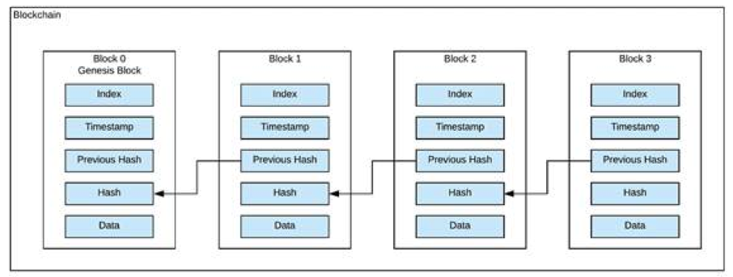
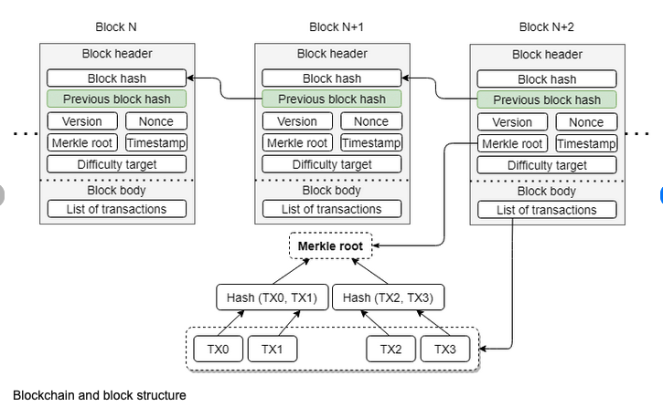

# Introduction to Ethereum

- [Ethereum is For Writing Decentralized Applications](#ethereum-is-for-writing-decentralized-applications)
- [Ethereum Architecture](#ethereum-architecture)
- [P2P Networks](#p2p-networks)
- [Nodes](#nodes)
- [Miners](#miners)
- [Blocks](#blocks)
- [Ethereum Virtual Machine (EVM)](#ethereum-virtual-machine-evm)
- [Ether Currency](#ether-currency)
- [Gas](#gas)
- [Ethereum Accounts]()
- [Ethereum Transaction]()
- [Testnet]()

Ethereum was proposed in 2013 by Vitalik Buterin, a cryptocurrency researcher and programmer. The first production release launched in 2015. Ethereum is an implementation of blockchain, and is an open source, public, and decentralized computing platform. Ethereum gained popularity because of its smart contract's features. Developers can program their smart contracts and execute them on the blockchain platform so that the full potential of the blockchain's different properties can be used.

## Ethereum is for Writing Decentralized Applications

As discussed before, Bitcoin uses blockchain technology for payments using bitcoins as a currency. Bitcoin also supports a scripting language, with which you can write a small scripts. Bitcoin scripts have limited finctionalities and it is difficult to write complex scripts on it. Its scripting language is also not Turing-complete (it does not support loops). Bitcoin transactions are slow; normally, it gets processed in 10 minutes or more.

With Ethereum, writing complex smart contracts and utilizing other properties of blockchain becomes easy. Any programmer who knows Java, JavaScript, and other programming languages can easily learn to code in the Solidity language. Solidity is a Turing-complete language. Transactions on Ethereum are processed much faster as compared to Bitcoin transactions. Using all of these potentials, you can write decentralized applications that would run on the Ethereum blockchain. 

## Ethereum Architecture

Ethereum architecture consists of multiple entities that make its blockchain network. An Ethereum network has all the nodes connected to each other using the P2P network protocol; each node keeps the latest copy of the Ethereum blockchain ledger. A user can interact with the Ethereum network via the Ethereum client. The Ethereum client can be a desktop/mobile/web page:

- add photo

## P2P Networks

In a P2P network, two or more computers are connected to share their resources without going to a centralized server or machine. Nodes connected in a P2P network can share or consume network resources.

## Nodes

Nodes are devices in the blockchain network, which make the mesh of the blockchain network. Nodes can perform various types of tasks, such as being an active computer, cell phone, or disk drive as long as they are connected to the internet, and they participate in a blockchain network.

A node keeps the latest copy of the blockchain data (ledger) and, in some cases, process the transactions as well. Miners put nodes on the network and willingly share their computing power or disk space. Nodes can be of two types - _full nodes_ or _light nodes_.

- **Full nodes**
    - A full node in a blockchain network maintains the complete data structure of the blockchain ledger and participates in the blockchain network by verifying every block and transaction using their consensus rules. Full nodes always keep the latest copy of the ledger.

- **Lightweight nodes**
    - A light node does not maintain the full copy of the blockchain ledger. It verifies the transaction using a method called **Simple Payment Verificiation (SPV)**. SPV allows a node to verify whether a transaction has been included in the blockchain or not. This is verified without the need to download the entire blockchain on a machine. A light node just downloads the header information of the blocks, hence lower storage space is required in running light nodes.

## Miners

Owners of the nodes willingly contribute their computing resources or hard disk space to store and validate transactions; in return, they collect block reward and transaction fees from the transactions. The nodes that perform transaction execution and verification are called miners.

## Blocks

The blockchain maintains a series of blocks. Each block is linked together with the last generated block. A block contains multiple transactions. At the time of writing this book, blocks are generated using a PoW consensus algorithm called **Ethash** in Ethereum. In future it is planned to change to PoS.

Miners share their processing power with the Ethereum blockchain network to process all pending transactions and generate a new block. Each block is generated in approximately 15 seconds. At the time of writing, a miner who generates the block is rewarded with 3 ETH in their wallet. It is proposed that, in the future, it will be reduced from 3 ETH to 2 ETH per block. It may change in the future as well.

Each block has a defined gas limit: as of now, it is 8 million gas per block. This means that the total gas consumed by the transactions included in the block cannot exceed the 8 million gas limit per block.

A block contains a block header and transactions. A block can contain at least one transaction. A new block is added to the blockchain and linked to the previous block. The very first block in the blockchain is called the **genesis block**:

The block header contains metadata about the block and the previous block. It contains multiple fields, but it's only necessary to understand a few to have an idea of block generation:

- **Parent Hash**: always points to the parent block of the newly generated block. This child-to-parent link goes on until the genesis block.

- **Nonce**: is the number that is found by the miner to solve the cryptographic puzzle.

- **Receipts Root**: is the Keccak 256-but hash of the root node of the tree structure, which is populated with the receipts of each transaction.

- **Timestamp**: is the time when the block is found and added to the blockchain.

- **Transactions Root**: is the Keccak 256-bit hash of the root node of the tree structure, which is populated with each transaction.

- **State Root**: is the Keccak 256-bit hash of the root node of the state tree, after all transactions are executed.

- **NOTE**: You should know how hash functions work and what the properties of the hash functions are. Also, you should have a basic knowledge of asymmetric cryptography.

## Ethereum Virtual Machine (EVM)

EVM is the runtime environment for smart contracts. Ethereum supports multiple scripting languages for writing smart contracts. These smart contracts are then compiled and converted into EVM bytecodes. Bytecodes are then executed by EVM to perform operations on smart contracts.

## Ether Currency

Ethereum has its own cryptocurrency called **ether** (symbol: **ETH**). Ethere is a fungible coin, which means that a coin can be subdivided into smaller units. For example, 1 ETH can be subdivided into a maximum of 18 decimal places; the smallest value is calle **wei**. Ether is a crypto fuel for the Ethereum network.

For any transaction you perform on the Ethereum network, some gas is consumed to execute that transaction, and the gas is to be paid in ether only. This transaction fee that you pay to process your transaction does to the miners.

- **NOTE**: Ether is publicly traded on many centralized and decentralized exchanges. Some decentralized exchanges are also built upon the Ethereum blockchain itself using Solidity smart contracts.

### Smallest Unit - wei

The smallest unit of ether is denoted as wei. The conversion table for ether and wei is as follows:

| Unit                  | Wei value   | Wei                       | Ether value      | Ether                |
| ---                   | ---         | ---                       | ---              | ---                  |
| Wei                   | 1 wei       | 1                         | $10^{-18}$ ether | 0.000000000000000001 |
|Kwei (KiloWei/babbage) |$10^{3}$ wei | 1,000                     | $10^{-15}$ ether | 0.000000000000001    |
|Mwei (MegaWei/lovelace)|$10^{6}$ wei | 1,000,000                 | $10^{-12}$ ether | 0.000000000001       |
|Gwei (GigaWei/shannon) |$10^{9}$ wei | 1,000,000,000             | $10^{-9}$ ether  | 0.000000001          |
|microether (szabo)     |$10^{12}$ wei| 1,000,000,000,000         | $10^{-6}$ ether  | 0.000001             |
|milliether (finney)    |$10^{15}$ wei| 1,000,000,000,000,000     | $10^{-3}$ ether  | 0.001                |
|ether                  |$10^{18}$ wei| 1,000,000,000,000,000,000 | 1 ether          | 1                    |

The most commonly used terms are ether, gwei, and wei. These units are used in many places in the Ethereum ecosystem, such as when creating a new transaction, or when setting the gas price for a transaction. These units can also be used in th eSolidity language hence Solidity supports **wei**, **finney**, **szabo**, and **ether** units.

## Gas